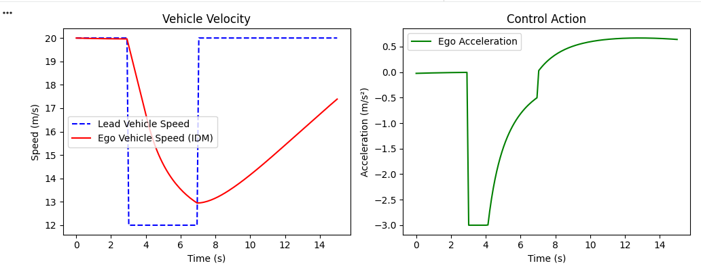
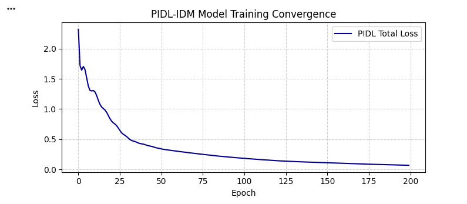
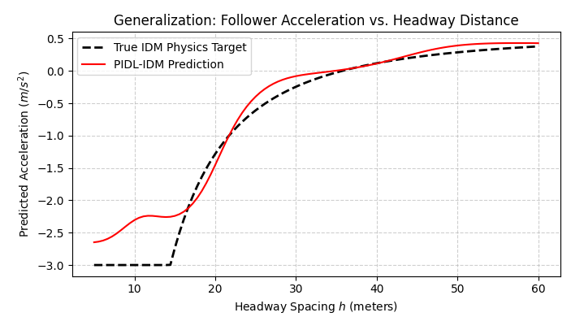

# cav-platoon-pidl: Physics-Informed Deep Learning & Intent-Sharing CACC Framework

A hybrid longitudinal control framework for Connected and Automated Vehicles (CAVs). This repository integrates **Physics-Informed Deep Learning for Car-Following (PIDL-CF)** with **Intent-Sharing Cooperative Adaptive Cruise Control (I-CACC)** to achieve safe, data-efficient, and string-stable platooning.

---

## Project Overview & Engineering Motivation

Autonomous longitudinal control models face a critical trade-off:
1. **Pure Physics Models (e.g., IDM, OVM):** Highly interpretable and physically constrained, but rigid and unable to capture human cognitive driving dynamics.
2. **Pure Data-Driven AI (e.g., ANNs, LSTMs):** High expressive capacity on empirical driving data (such as NGSIM), but data-hungry and prone to non-physical, hazardous acceleration predictions under sparse or unseen driving states.

**This Project's Approach:** 
We combine domain physics directly into the learning objective:
* **Physics-Informed Loss Regularization:** Embedding classical car-following dynamics (Intelligent Driver Model) as a computational graph inside the neural network loss function, penalizing physical constraint violations across unobserved collocation states.
* **V2V Intent Coordination:** Incorporating compact vehicle-to-vehicle (V2V) intent bounds ($[v_{\min}, v_{\max}], [a_{\min}, a_{\max}]$) into a continuous reinforcement learning controller (TD3) to mitigate string instability and eliminate shockwave amplification.

---

##  Mathematical Formulation

### 1. Longitudinal Physics Baseline (Intelligent Driver Model - IDM)
The baseline longitudinal acceleration $a(t + \Delta t)$ is governed by:
$$a(t + \Delta t) = a_{\max} \left[ 1 - \left(\frac{v(t)}{v_0}\right)^\delta - \left(\frac{s^*(v(t), \Delta v(t))}{h(t)}\right)^2 \right]$$

Where the dynamic desired safe gap s* is defined as:
s*(v(t), dv(t)) = s0 + v(t) * T0 + (v(t) * dv(t)) / (2 * sqrt(a_max * b))

* $h(t)$: Headway distance to lead vehicle
* $\Delta v(t)$: Relative velocity difference ($v_{\text{ego}} - v_{\text{lead}}$)
* $v(t)$: Ego vehicle velocity
* Parameters calibrated from literature: $v_0 = 30\text{ m/s}$, $T_0 = 1.5\text{ s}$, $s_0 = 2.0\text{ m}$, $a_{\max} = 0.73\text{ m/s}^2$, $b = 1.63\text{ m/s}^2$, $\delta = 4.0$.

### 2. Physics-Informed Hybrid Loss Function (PIDL-CF)
To train the Physics-Uninformed Neural Network (PUNN) $f_\theta$, we formulate a composite loss balancing empirical observation discrepancy ($\text{MSE}_O$) with physics consistency across collocation points ($\text{MSE}_C$):
$$\mathcal{L}(\theta) = \alpha \cdot \text{MSE}_O + (1 - \alpha) \cdot \text{MSE}_C$$

$$\mathcal{L}(\theta) = \frac{\alpha}{N_O} \sum_{i=1}^{N_O} \left\Vert{} f_\theta(\hat{s}^{(i)}) - \hat{a}^{(i)} \right\Vert{}^2 + \frac{1 - \alpha}{N_C} \sum_{j=1}^{N_C} \left\Vert{} f_\theta(s^{(j)}) - f_{\hat{\lambda}}(s^{(j)}) \right\Vert{}^2$$

* $\alpha \in [0, 1]$: Loss balance parameter (default: $\alpha = 0.7$)
* Collocation states $s^{(j)} \in \mathcal{C}$ are sampled across the operational domain $(h, \Delta v, v)$ to enforce safety boundaries (such as emergency braking saturation at $h < 15\text{ m}$) even when training data is sparse.

---
## Preliminary Results & Validation

### 1. IDM Baseline Dynamic Response
Simulating a sudden lead-vehicle deceleration event ($20\text{ m/s} \rightarrow 12\text{ m/s}$) to verify longitudinal car-following stability and smooth braking saturation ($-3.0\text{ m/s}^2$).



### 2. PIDL Training Convergence
Monotonic decay of the hybrid physics loss ($\mathcal{L}_{\theta} = \alpha \text{MSE}_O + (1-\alpha)\text{MSE}_C$), confirming simultaneous optimization across empirical observations and unobserved collocation points without gradient explosion.



### 3. Policy Generalization & Safety Boundary
Predicted follower acceleration across the headway distance domain ($h \in [5, 60]\text{ m}$). The neural policy aligns with the ground-truth IDM target and enforces maximum emergency braking ($-3.0\text{ m/s}^2$) at critical gaps ($h < 15\text{ m}$), preventing unsafe positive accelerations.



## Repository Structure

```text
cav-platoon-pidl/
│
├── README.md               # Architecture documentation, math formulation & results
├── baseline_idm.py         # Classical IDM car-following simulation engine
├── pidl_model.py           # PUNN PyTorch architecture & hybrid physics loss module
├── train_pidl.py           # Training pipeline, collocation sampler, and evaluation visualizer
└── requirements.txt        # Python dependencies (torch, numpy, matplotlib)
